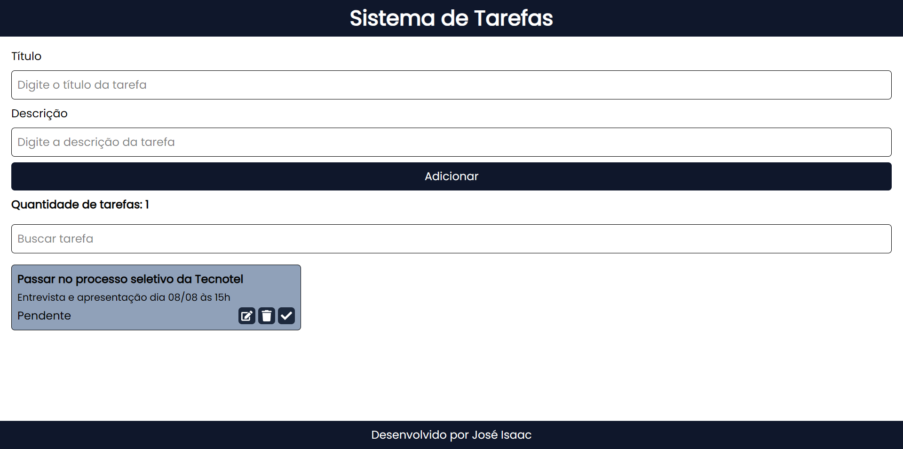

# 🧪 Teste Técnico - API de Tarefas

API RESTful desenvolvida como parte de um teste técnico para gerenciar tarefas (To-Do List), utilizando **Node.js**, **Express**, **Prisma** e **SQLite**.

# Ilustrações
## Desktop:
<p align="center">
  
</p>

## Mobile:
<p align="center">
  
</p>

---

## 🚀 Tecnologias utilizadas

- Node.js
- Express
- Prisma ORM
- SQLite
- Dotenv
- Nodemon (para ambiente de desenvolvimento)

---

## ⚙️ Funcionalidades

- ✅ Criar uma nova tarefa
- 🔍 Visualizar todas as tarefas
- 🔍 Buscar tarefa por ID
- ✏ Atualizar uma tarefa existente
- 🗑 Excluir uma tarefa

---

## 🗂 Estrutura do projeto

Este projeto é dividido em duas partes:

- `server/` → API REST com Node.js, Express, Prisma e SQLite
- `client/` → Interface web com Vite, React e TailwindCSS

```bash
📦 teste-tecnico-tecnotel
├─ .gitattributes
├─ .gitignore
├─ README.md
├─ client
│  ├─ .gitignore
│  ├─ README.md
│  ├─ eslint.config.js
│  ├─ index.html
│  ├─ package-lock.json
│  ├─ package.json
│  ├─ src
│  │  ├─ App.jsx
│  │  ├─ Components
│  │  │  ├─ Loader
│  │  │  │  └─ index.jsx
│  │  │  ├─ Modal
│  │  │  │  └─ index.jsx
│  │  │  ├─ TaskForm
│  │  │  │  └─ index.jsx
│  │  │  ├─ TaskList
│  │  │  │  └─ index.jsx
│  │  │  └─ TaskPage
│  │  │     └─ index.jsx
│  │  ├─ assets
│  │  │  └─ Poppins-Regular.ttf
│  │  ├─ index.css
│  │  └─ main.jsx
│  └─ vite.config.js
├─ package-lock.json
├─ package.json
└─ server
   ├─ generated
   │  └─ prisma
   │     ├─ client.d.ts
   │     ├─ client.js
   │     ├─ default.d.ts
   │     ├─ default.js
   │     ├─ edge.d.ts
   │     ├─ edge.js
   │     ├─ index-browser.js
   │     ├─ index.d.ts
   │     ├─ index.js
   │     ├─ package.json
   │     ├─ query_engine-windows.dll.node
   │     ├─ runtime
   │     │  ├─ edge-esm.js
   │     │  ├─ edge.js
   │     │  ├─ index-browser.d.ts
   │     │  ├─ index-browser.js
   │     │  ├─ library.d.ts
   │     │  ├─ library.js
   │     │  ├─ react-native.js
   │     │  ├─ wasm-compiler-edge.js
   │     │  └─ wasm-engine-edge.js
   │     ├─ schema.prisma
   │     ├─ wasm.d.ts
   │     └─ wasm.js
   ├─ lib
   │  └─ prismaClient.js
   ├─ package-lock.json
   ├─ package.json
   ├─ prisma
   │  ├─ dev.db
   │  ├─ migrations
   │  │  ├─ 20250805094928_init
   │  │  │  └─ migration.sql
   │  │  └─ migration_lock.toml
   │  └─ schema.prisma
   ├─ routes
   │  └─ tasksRouter.js
   └─ server.js
```

## 📦 Instalação

### ⚠️ Requisitos

Antes de começar, certifique-se de que você tem o **Node.js instalado (versão 18 ou superior)**.

🔗 Baixe aqui: [https://nodejs.org/en](https://nodejs.org/en)

Para verificar se está instalado:

```bash
node -v
npm -v
```

### 1. Clone o repositório:

```bash
git clone https://github.com/joseisaacpy/teste-tecnico-tecnotel

cd teste-tecnico-tecnotel

```

### 2. Copie as variáveis de ambiente

No Linux/Mac:

```bash
cp server/.env.example server/.env
```

No Windows (CMD):

```bash

copy server\.env.example server\.env
```

### 3. Instale as dependências

```bash
npm i
```

### 4. Gere o banco com Prisma

```bash
cd server
npx prisma db push
```
### 5. Rode o seed para popular dados iniciais (opcional)

```bash
node seed.js
```

### 4. Rode o projeto (client + server)

```bash
cd ..
npm run dev
```

🔹 Um arquivo de banco de dados SQLite (`dev.db`) será criado automaticamente na pasta `prisma/`.

## 📡 Endpoints da API

| Método | Rota         | Descrição                     |
| ------ | ------------ | ----------------------------- |
| POST   | `/tasks`     | Cria uma nova tarefa          |
| GET    | `/tasks`     | Lista todas as tarefas        |
| GET    | `/tasks/:id` | Busca uma tarefa pelo ID      |
| PUT    | `/tasks/:id` | Atualiza uma tarefa existente |
| DELETE | `/tasks/:id` | Deleta uma tarefa             |

## 👤 Autor

- José Isaac Nascimento
- [LinkedIn](https://www.linkedin.com/in/jos%C3%A9-isaac-nascimento/)

## 📝 Licença

Este projeto está sob a Licença MIT.
